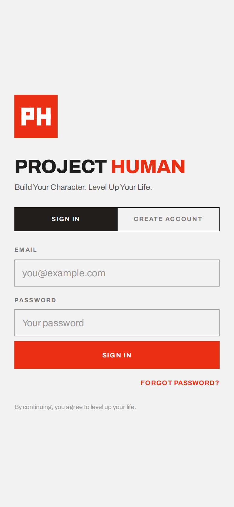
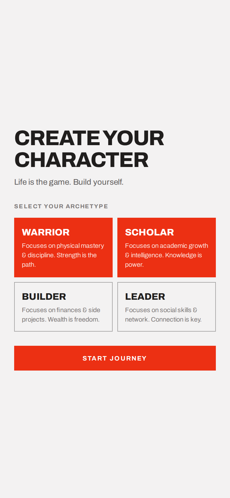
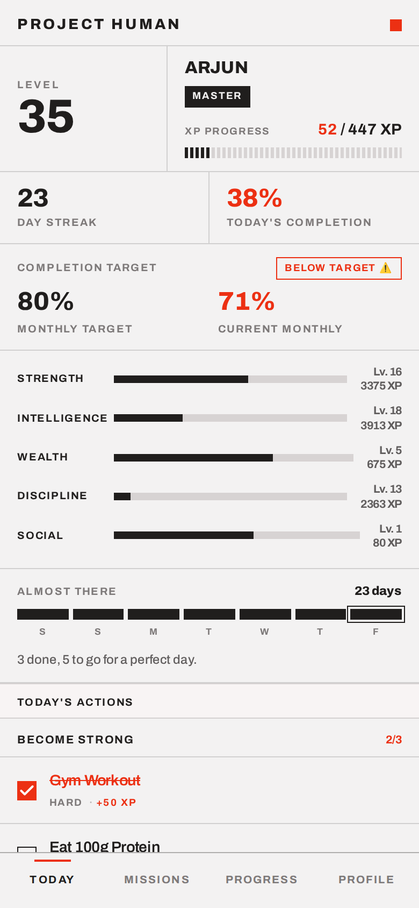
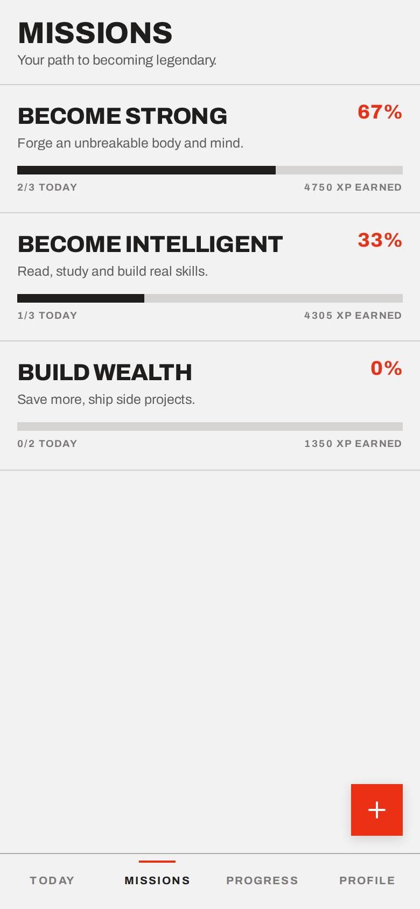
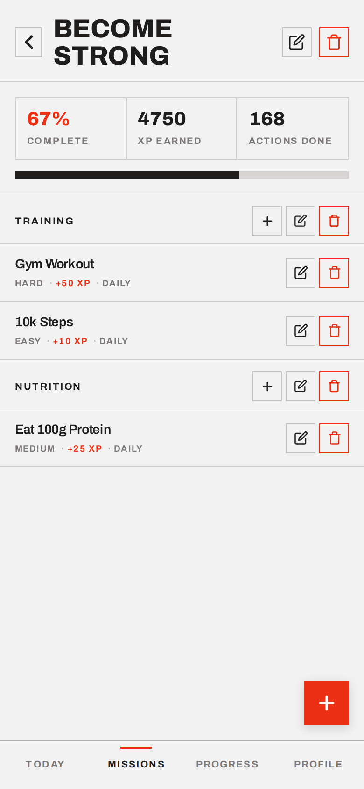
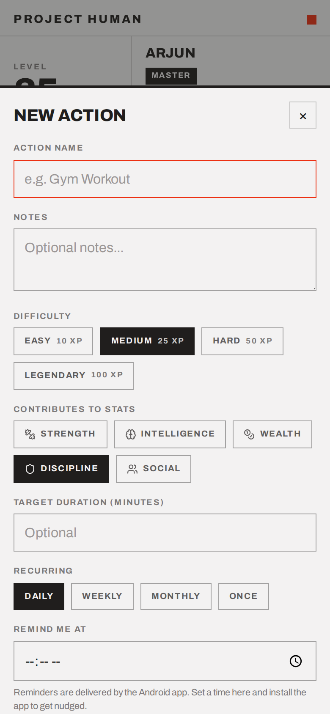
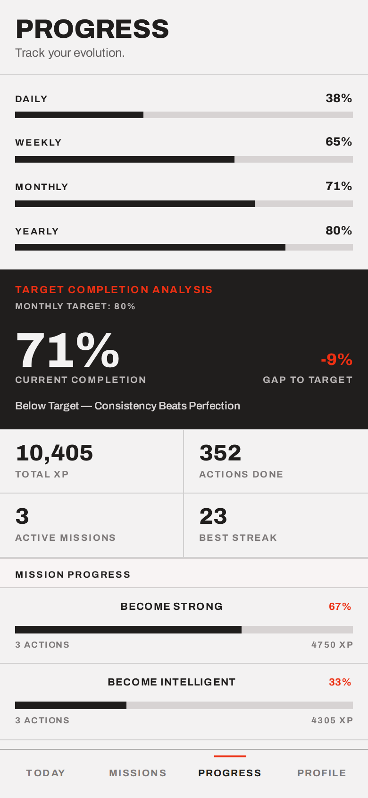
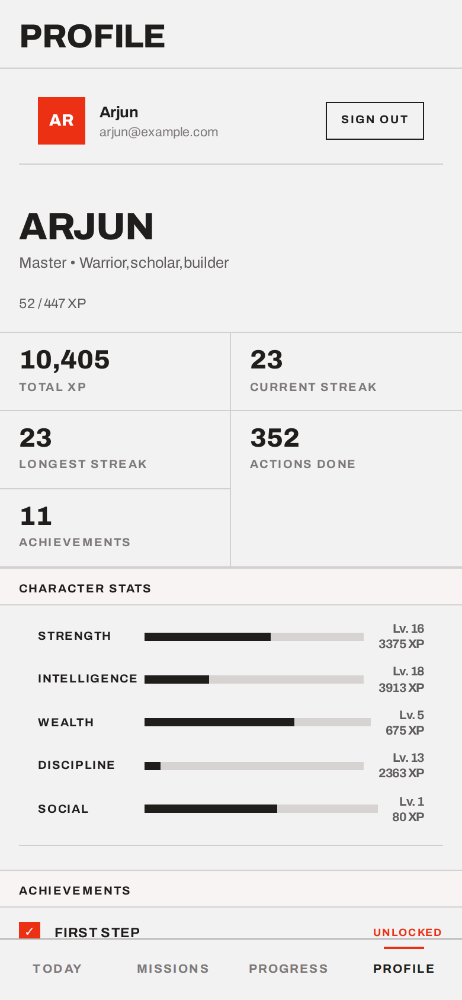

# Project Human

A habit tracker that works like an RPG. You make a character, set goals as missions, and each thing you get done gives you XP. Your level, rank and five stats all go up from real stuff you did, like gym, reading or saving money.

I made it for myself. Plain checklists never kept me going for more than a week, but levelling up in games always did, so I tried putting that into my daily routine.

**Live:** https://project-human.netlify.app

## Screenshots

| Sign in | Pick archetypes | Today |
|:-:|:-:|:-:|
|  |  |  |
| **Missions** | **Inside a mission** | **Adding an action** |
|  |  |  |
| **Progress** | **Profile** | |
|  |  | |

*These use a demo account with about two months of made-up history.*

## How it works

1. **Sign up** with email and password. You enter your phone number at sign-up and it's saved to your profile.
2. **Make a character.** Pick a name and one or more archetypes: Warrior, Scholar, Builder or Leader. Each one adds a starter mission with a few actions, so you don't begin with an empty screen.
3. **Missions** are the big goals ("Become Strong"). You can group their actions under attributes if you want, like Training and Nutrition.
4. **Actions** are the things you actually do. Each one has a difficulty, a schedule (daily, weekly, monthly or once), the stats it counts towards, and optionally a target duration and a reminder time.
5. The **Today** screen lists what's due. Tick an action off and you get its XP. If you tapped by mistake, there's an undo on the toast.

### XP and levels

| Difficulty | XP |
|---|---|
| Easy | 10 |
| Medium | 25 |
| Hard | 50 |
| Legendary | 100 |

Reaching level *N* takes `floor(50 × N^1.5)` total XP. That means the first few levels come in a couple of days and the later ones take months. When an action counts towards more than one stat, its XP is split evenly between them, so tagging everything with every stat doesn't help.

Your rank depends on your level: Civilian (1–4), Apprentice (5–9), Warrior (10–19), Elite (20–29), Master (30–49), Legend (50+).

The five stats are Strength, Intelligence, Wealth, Discipline and Social. Each one levels up on its own, so you can see which parts of your life are getting attention and which aren't.

### Streaks, targets, achievements

- **Streak:** the number of days in a row you've completed at least one action. It's rebuilt from your completion history every time, so you can't fake it.
- **80% monthly target:** the Progress screen compares your month against 80%, not 100%. Missing a day now and then is normal, and the app is built with that in mind.
- **Daily victory:** you get a full-screen card at 80%, 90% and 100% of the day's actions. Each tier shows up once per day.
- **13 achievements**, from "First Step" up to 10,000 XP and 30-day streaks.

### Other bits

- Everything is stored in Firestore under your account and updates live across devices. Firestore's offline cache means the app keeps working without internet and syncs when you're back online.
- Haptic feedback, and it gets stronger for harder actions. Animations use transforms, so they stay smooth on 120/144Hz screens, and they're turned off if your system asks for reduced motion.
- The back button moves back through the app's screens instead of closing it. This works in the browser, the installed PWA and the Android app.

## Tech

- Plain HTML, CSS and JavaScript (ES modules). No framework and no build step.
- Firebase Auth (email/password) and Cloud Firestore
- Lucide icons and the Archivo font, both loaded from a CDN
- Hosted on Netlify, with a PWA manifest
- An Android wrapper in Kotlin (WebView, min SDK 26, target SDK 34)

```
index.html        every screen, overlay and modal
index.css         styles
app.js            app logic (state, rendering, XP, streaks, Firestore sync)
firebase.js       Firebase setup
auth-action.*     page for password-reset and email-verify links
verify-boot.js    quick checks on the boot flow and markup (node verify-boot.js)
scripts/          local dev server
android/          Android app
```

## Running it locally

```bash
git clone https://github.com/GopiKishan09/Project-Human.git
cd Project-Human
node scripts/dev-server.js      # http://localhost:8123
```

Opening the file with `file://` won't work, because ES modules and Firebase need a real http origin. Any static server is fine.

To check the boot flow and markup without touching Firebase:

```bash
npm install
node verify-boot.js
```

### Using your own Firebase project

`firebase.js` points at my project. To use your own:

1. Create a Firebase project and turn on **Email/Password** sign-in.
2. Create a Cloud Firestore database.
3. Paste your web config into `firebase.js`.
4. Add your domain under Auth → Authorized domains.

Data lives under `users/{uid}`, with the subcollections `missions`, `attributes`, `actions` and `completions`. A completion's ID is `{actionId}_{YYYY-MM-DD}`, which means an action can only be completed once per day.

## Android app

`android/` has a small Kotlin app that loads the live site in a full-screen WebView. The web version can't do everything a native app can, so the wrapper adds:

- A splash screen that checks your connection, with a retry screen if you're offline
- **Reminders.** When you set a "Remind me at" time on an action, the web app passes it to the native side through a JS bridge. The Android app schedules it with `AlarmManager` and it plays its own chime. Reminders fire even when the app is closed, and they're set up again after the phone restarts.
- The Android back button goes through the web app's back handling
- Login cookies are kept, so you stay signed in

Build it with:

```bash
cd android
./gradlew assembleDebug
# app/build/outputs/apk/debug/app-debug.apk
```

You'll need the Android SDK 34 and JDK 17 (Android Studio's bundled one works).

## Ideas I haven't built yet

- Friends and leaderboards
- A home-screen widget
- An iOS wrapper
- Better charts for history

If you want to try any of these, PRs are welcome.
